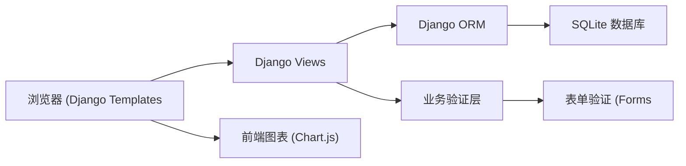
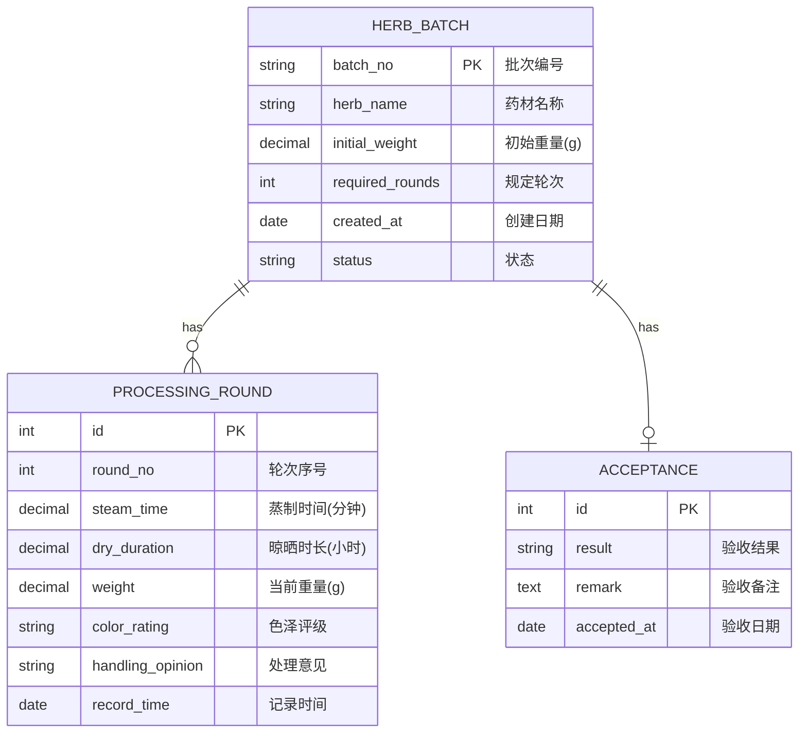

## 1. 架构设计



## 2. 技术栈
- 后端：Python 3.10+、Django 4.2 LTS
- 前端：Django Templates + Bootstrap 5
- 数据库：SQLite（开发环境）
- 图表：Chart.js（CDN 引入）
- 样式：Bootstrap 5 + 自定义 CSS

## 3. 路由定义
| 路由 | 视图 | 用途 |
|------|------|------|
| / | BatchListView | 批次列表首页 |
| /batch/create/ | BatchCreateView | 新建批次 |
| /batch/<int:pk>/ | BatchDetailView | 批次详情 |
| /batch/<int:pk>/round/create/ | RoundCreateView | 新增炮制轮次 |
| /batch/<int:pk>/accept/ | AcceptanceView | 提交验收 |
| /batch/<int:pk>/chart/ | BatchChartView | 图表数据 API |

## 4. 数据模型



## 5. 核心验证规则
1. 批次编号唯一且不重复
2. 蒸制时间 > 0
3. 晾晒时长 > 0
4. 当前重量 ≤ 初始重量
5. 轮次序号按顺序递增
6. 未完成规定轮次不可验收
7. 色泽评级异常必须填写处理意见

## 6. 项目结构
```
nyh-67/
├── manage.py
├── requirements.txt
├── herb_processing/
│   ├── settings.py
│   ├── urls.py
│   └── wsgi.py
└── processing/
    ├── models.py
    ├── forms.py
    ├── views.py
    ├── urls.py
    ├── admin.py
    └── templates/
        └── processing/
            ├── base.html
            ├── batch_list.html
            ├── batch_detail.html
            ├── batch_form.html
            ├── round_form.html
            └── acceptance_form.html
```
