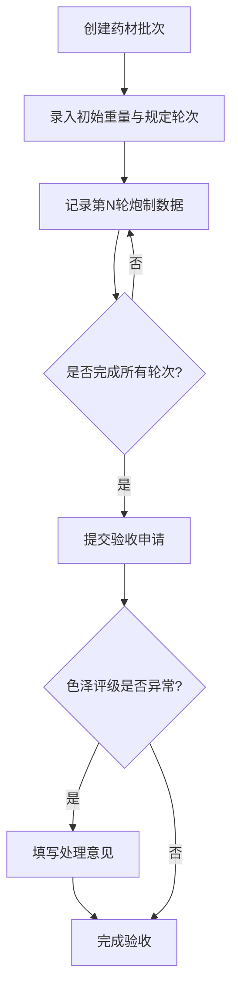

## 1. 产品概述

传统药材炮制管理系统，用于记录和管理药材蒸制、晾晒、称重及色泽变化的全流程管理，支持批次追溯、轮次记录、质量监控与最终验收。

- 目标用户：中药炮制工艺师、质量检验员、生产管理人员
- 产品价值：标准化炮制流程、保障药材质量、实现全流程可追溯

## 2. 核心功能

### 2.1 用户角色
| 角色 | 注册方式 | 核心权限 |
|------|----------|----------|
| 工艺员 | 系统分配 | 创建批次、记录炮制轮次、提交验收 |
| 质检员 | 系统分配 | 查看数据、审核验收、查看质量报表 |

### 2.2 功能模块
1. **批次管理**：创建/编辑/查看药材批次列表
2. **炮制轮次记录**：蒸制时间、晾晒时长、重量、色泽评级
3. **质量验收**：最终验收、重量损耗曲线、轮次质量对比
4. **数据可视化**：重量损耗曲线图、轮次质量对比图

### 2.3 页面详情
| 页面名称 | 模块名称 | 功能描述 |
|-----------|----------|----------|
| 批次列表 | 批次表格 | 展示所有批次信息，支持搜索筛选 |
| 批次详情 | 轮次记录、重量曲线、质量对比 | 查看单个批次的完整炮制记录 |
| 新建批次 | 批次表单 | 创建新的药材批次 |
| 记录轮次 | 轮次表单 | 记录每轮蒸制晾晒数据 |
| 验收管理 | 验收表单 | 完成最终验收，处理色泽异常 |

## 3. 核心流程

## 4. 用户界面设计

### 4.1 设计风格
- 主色调：赭石棕 (#8B4513)、草本绿 (#2E8B57)、宣纸米白 (#FAF0E6)
- 辅色调：墨灰 (#333333)、朱砂红 (#B22222)（异常警示）
- 按钮风格：圆角方形，古典质感，边框
- 字体：思源宋体（标题）、思源黑体（正文）
- 布局风格：卡片式布局，古典中式风格点缀
- 图标风格：线性简约图标，配中式纹样装饰

### 4.2 页面设计概览
| 页面名称 | 模块名称 | UI元素 |
|-----------|----------|--------|
| 批次列表 | 数据表格 | 中式边框、筛选栏、操作按钮 |
| 批次详情 | 轮次时间轴 | 时间轴展示、图表区域、数据卡片 |
| 新建/编辑表单 | 表单卡片 | 标签输入、下拉选择、数值校验提示 |

### 4.3 响应式
- 桌面端优先设计，适配 1280px 以上屏幕
- 表格在移动端转为卡片列表展示
- 图表自适应容器宽度
